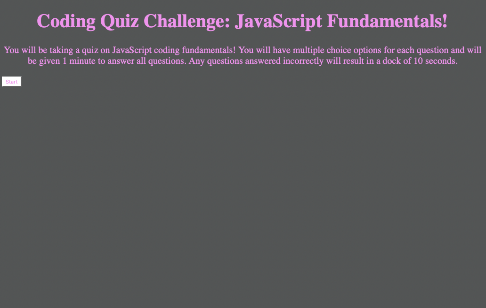

# CodeQuiz_Challenge
Web APIs Challenge: Code Quiz

Build a timed coding quiz with multiple choice questions. User should be able to pick see a timer alongside questions and time should be deducted if question is answered incorrectly. Once all questions are answered or time reaches zero then the game will be over. Final scores should be able to be saved  with users initials.

Live URL

